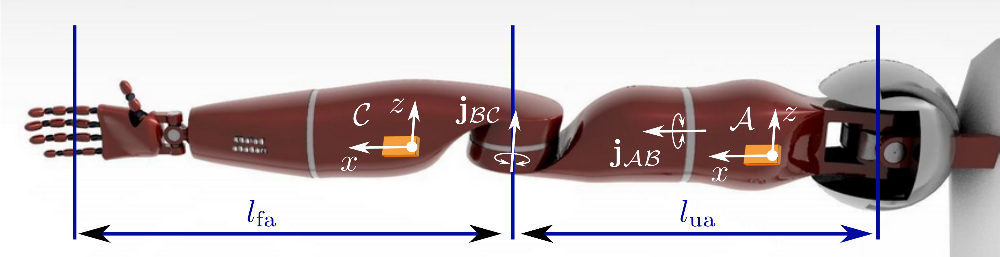
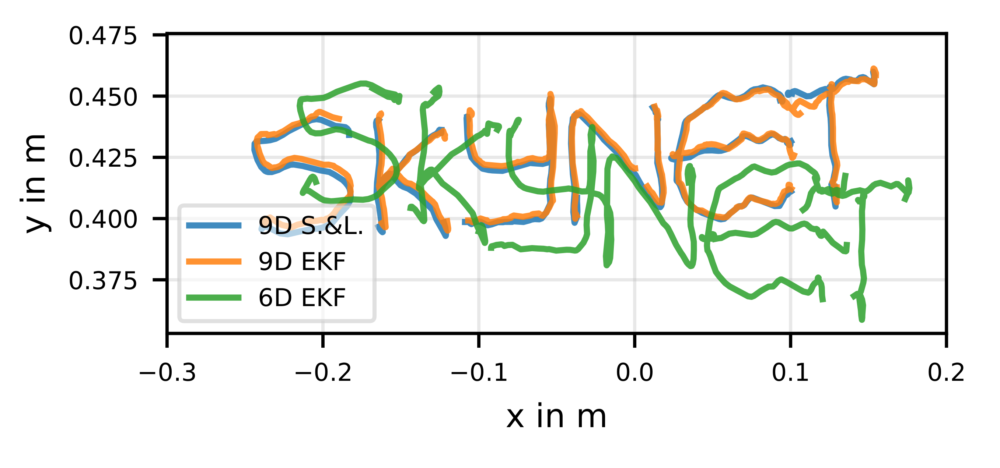

# University Project: Inertial Sensor Fusion 
This repo includes the main implementation that was written in MATLAB (in accordance with the project’s requirements). In addition, there is also a 9D EKF implementation in Python. Please refer to the [extended abstract](Extended_Abstract.pdf) for further details.

# Introduction
In recent years Inertial Measurement Units (IMUs) have
become widely popular for tracking the motion of kinematic
chains. This is mainly due to their low cost and small form
factor as well as advances in sensor fusion algorithms.
While attached to rigid segments of a kinematic chain,
IMUs provide inertial 9D measurements consisting of 3D
accelerometer, 3D magnetometer, and 3D gyroscope data.
Especially magnetometer readings are prone to inaccuracies
when used in indoor environments or close to other electronic
devices. When omitting the magnetometer and relying solely
on accelerometer and gyroscope readings, valuable heading
information is lost. To overcome this issue often kinematic
constraints are introduced to correct the heading. This approach is also applicable when using distorted magnetometer
data. Kinematic constraints can also be used to overcome
issues such as bias drift.
The aim of this project was to compare two 9D IMU sensor
fusion approaches with a 6D magnetometer-free method. In
addition, the potential of exploiting kinematic constraints to
improve position estimates was explored. Results are presented
based on measurements of two IMUs mounted on a robotic
arm performing a drawing motion in the x-y plane.

 

# Results
 
